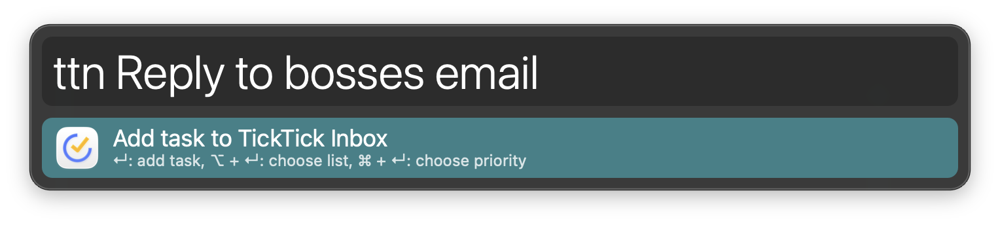
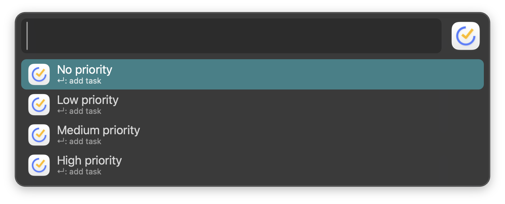
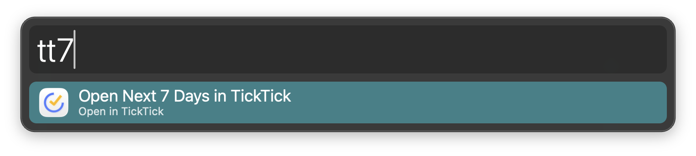

# TickTick Inbox

## Setup

On first list selection, allow Alfred to control TickTick if macOS asks.

## Usage

Add a task to the TickTick Inbox via the `ttn` keyword.

* <kbd>↩</kbd> Add task.
* <kbd>⌥</kbd><kbd>↩</kbd> Choose list.
* <kbd>⌘</kbd><kbd>↩</kbd> Choose priority.

Lists come from TickTick. Priorities are None, Low, Medium, and High. TickTick opens after adding.

Write dates the way you normally would. Phrases like `today`, `tomorrow`, `next week`, or `in 2 weeks` in the task title are picked up by TickTick’s [Smart Date Recognition](https://help.ticktick.com/articles/7081924556310446080) and set the due date.

Open Inbox, Today, or Next 7 Days via the `tti`, `ttt`, and `tt7` keywords.

Alternatively, send selected text to the Inbox via the Universal Action. The same modifiers apply.

Change keywords in the Workflow’s Configuration.

[Development](docs/DEVELOPMENT.md)

[MIT License](LICENSE)
